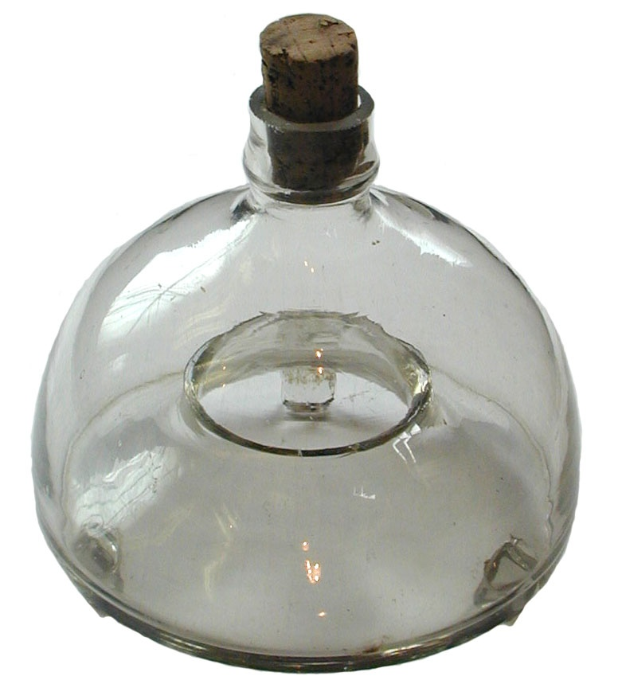

<script>
!--    google analytics-->

  (function(i,s,o,g,r,a,m){i['GoogleAnalyticsObject']=r;i[r]=i[r]||function(){
  (i[r].q=i[r].q||[]).push(arguments)},i[r].l=1*new Date();a=s.createElement(o),
  m=s.getElementsByTagName(o)[0];a.async=1;a.src=g;m.parentNode.insertBefore(a,m)
  })(window,document,'script','https://www.google-analytics.com/analytics.js','ga');

  ga('create', 'UA-74338484-2', 'auto');
  ga('send', 'pageview');

</script>


```{r echo=FALSE}
library(readxl)
library(knitr)
library(kableExtra)

PlanSemanal <-  read_excel("Witt.xlsx")
Notas <- read_excel("Witt.xlsx", sheet = "notas")
Semana <- 1
```

## Descripción del seminario



Los escritos filosóficos de Wittgenstein ejercen una fascinación especial en quien los lee con paciencia y cuidado. En este seminario, estudiaremos dos:  el *Tractatus Logico-Philosophicus* y las *Investigaciones Filosóficas*. 

El *Tractactus* es una investigación lógica sobre lenguaje enmarcada en la línea de Gottlob Frege y Bertrand Russell; es un texto abstracto, técnico y poco amable con el lector, pero cuya inusual mezcla de lógica, metafísica, y mística se presta para una multiplicidad de interpretaciones y énfasis. 

Las *Investigaciones * es una investigación sobre el lenguaje y la mente, rica en ejemplos concretos y descriptivos, aunque quizá un tanto enmarañados y que no siempre tienen un propósito filosófico claro; es un rechazo a las posiciones del *Tractatus* y es la obra más influyente de Wittgenstein.  

El estudio de estas dos obras nos ofrece la oportunidad de ver el cambio en la concepción filosófica de Wittgenstein y su particular forma de pensar y hacer filosofía. En la primera parte del seminario, estudiaremos el *Tractatus* de la mano de Tomasini (2017), quien nos ofrecerá una visión sinóptica del libro y con base en la cual podremos realizar una aproximación propia al texto. En la segunda parte del seminario, estudiaremos las *Investigaciones* enfocándonos en pasajes particulares de la obra, buscando entender conceptos centrales como "juego del lenguaje", "regla" y "representación perspicua".

**Profesor**:
[Juan Camilo Espejo-Serna](../index.html)\

**Horario y salón**: Martes, 10:00am - 1:00pm. Atelier 103

**Página web del seminario**:
https://jcunisabana.github.io/Witt/


## Objetivos

      
- Leer críticamente, analizar e interpretar la propuesta filosófica temprana de Ludwig Wittgenstein.

- Leer críticamente, analizar e interpretar la propuesta filosófica tardía de Ludwig Wittgenstein.

- Planear y elaborar textos interpretativos y argumentativos con base en las teorías de Ludwig Wittgenstein.

- Utilizar TIC para apoyar el estudio filosófico de la obra de Ludwig Wittgenstein


## Metodología


#### **Antes de la sesión**

- Quienes estén a cargo de la presentación oral deberán preparar una exposición de 20-25 minutos de duración. Deben consultar **siempre** con el profesor (¡antes de la sesión!) y ponerse de acuerdo en una estrucutra para la presentación.

- Todos los estudiantes deberán subir un control de lectura por tarde **75 horas** antes de la sesión.

#### **Durante la sesión**

- Quienes esten a cargo de la presentación oral deberán realizar su exposición. Pueden, por ejemplo, escribir un texto para ser leído, o preparar diapositivas para guiar su exposición o utilizar el tablero como apoyo. Es su decisión pero deben tener en cuenta que el objetivo es lograr presentar y explicar el texto correspondiente.

- Todos deben atender con cuidado a la exposición y formular preguntas al respecto. Revisen si entienden la exposición y si están de acuerdo; pregunten por las relaciones con los temas anteriormente expuestos.


---

## Plan semanal 


### `r  PlanSemanal$FechaText[Semana]`

**Semana `r Semana`**

`r PlanSemanal$Tema[Semana]`

<div style="border: 3px solid  #E95420 ; padding: 5px;"  margin-top: 50px; margin-right: 50px; margin-left: 50px; ">
*Actividades*

`r PlanSemanal$Actividades[Semana]`

</div>

<div style="color:white; background-color: #E95420 ; padding: 5px;"  margin-bottom: 50px; margin-right: 50px; margin-left: 50px; ">
*Para la próxima*

`r PlanSemanal$Tareas[Semana]`


</div>


---
`r Semana <- Semana +1`

### `r  PlanSemanal$FechaText[Semana]`

**Semana `r Semana`**

`r PlanSemanal$Tema[Semana]`

<div style="border: 3px solid  #E95420 ; padding: 5px;"  margin-top: 50px; margin-right: 50px; margin-left: 50px; ">
*Actividades*

`r PlanSemanal$Actividades[Semana]`

</div>

<div style="color:white; background-color: #E95420 ; padding: 5px;"  margin-bottom: 50px; margin-right: 50px; margin-left: 50px; ">
*Para la próxima*

`r PlanSemanal$Tareas[Semana]`


</div>


---
`r Semana <- Semana +1`

### `r  PlanSemanal$FechaText[Semana]`

**Semana `r Semana`**

`r PlanSemanal$Tema[Semana]`

<div style="border: 3px solid  #E95420 ; padding: 5px;"  margin-top: 50px; margin-right: 50px; margin-left: 50px; ">
*Actividades*

`r PlanSemanal$Actividades[Semana]`

</div>

<div style="color:white; background-color: #E95420 ; padding: 5px;"  margin-bottom: 50px; margin-right: 50px; margin-left: 50px; ">
*Para la próxima*

`r PlanSemanal$Tareas[Semana]`


</div>


---
`r Semana <- Semana +1`

### `r  PlanSemanal$FechaText[Semana]`

**Semana `r Semana`**

`r PlanSemanal$Tema[Semana]`

<div style="border: 3px solid  #E95420 ; padding: 5px;"  margin-top: 50px; margin-right: 50px; margin-left: 50px; ">
*Actividades*

`r PlanSemanal$Actividades[Semana]`

</div>

<div style="color:white; background-color: #E95420 ; padding: 5px;"  margin-bottom: 50px; margin-right: 50px; margin-left: 50px; ">
*Para la próxima*

`r PlanSemanal$Tareas[Semana]`


</div>


---
`r Semana <- Semana +1`

### `r  PlanSemanal$FechaText[Semana]`

**Semana `r Semana`**

`r PlanSemanal$Tema[Semana]`

<div style="border: 3px solid  #E95420 ; padding: 5px;"  margin-top: 50px; margin-right: 50px; margin-left: 50px; ">
*Actividades*

`r PlanSemanal$Actividades[Semana]`

</div>

<div style="color:white; background-color: #E95420 ; padding: 5px;"  margin-bottom: 50px; margin-right: 50px; margin-left: 50px; ">
*Para la próxima*

`r PlanSemanal$Tareas[Semana]`


</div>


---
`r Semana <- Semana +1`

### `r  PlanSemanal$FechaText[Semana]`

**Semana `r Semana`**

`r PlanSemanal$Tema[Semana]`

<div style="border: 3px solid  #E95420 ; padding: 5px;"  margin-top: 50px; margin-right: 50px; margin-left: 50px; ">
*Actividades*

`r PlanSemanal$Actividades[Semana]`

</div>

<div style="color:white; background-color: #E95420 ; padding: 5px;"  margin-bottom: 50px; margin-right: 50px; margin-left: 50px; ">
*Para la próxima*

`r PlanSemanal$Tareas[Semana]`


</div>


---
`r Semana <- Semana +1`

### `r  PlanSemanal$FechaText[Semana]`

**Semana `r Semana`**

`r PlanSemanal$Tema[Semana]`

<div style="border: 3px solid  #E95420 ; padding: 5px;"  margin-top: 50px; margin-right: 50px; margin-left: 50px; ">
*Actividades*

`r PlanSemanal$Actividades[Semana]`

</div>

<div style="color:white; background-color: #E95420 ; padding: 5px;"  margin-bottom: 50px; margin-right: 50px; margin-left: 50px; ">
*Para la próxima*

`r PlanSemanal$Tareas[Semana]`


</div>


---
`r Semana <- Semana +1`

### `r  PlanSemanal$FechaText[Semana]`

**Semana `r Semana`**

`r PlanSemanal$Tema[Semana]`

<div style="border: 3px solid  #E95420 ; padding: 5px;"  margin-top: 50px; margin-right: 50px; margin-left: 50px; ">
*Actividades*

`r PlanSemanal$Actividades[Semana]`

</div>

<div style="color:white; background-color: #E95420 ; padding: 5px;"  margin-bottom: 50px; margin-right: 50px; margin-left: 50px; ">
*Para la próxima*

`r PlanSemanal$Tareas[Semana]`


</div>


---
`r Semana <- Semana +1`

### `r  PlanSemanal$FechaText[Semana]`

**Semana `r Semana`**

`r PlanSemanal$Tema[Semana]`

<div style="border: 3px solid  #E95420 ; padding: 5px;"  margin-top: 50px; margin-right: 50px; margin-left: 50px; ">
*Actividades*

`r PlanSemanal$Actividades[Semana]`

</div>

<div style="color:white; background-color: #E95420 ; padding: 5px;"  margin-bottom: 50px; margin-right: 50px; margin-left: 50px; ">
*Para la próxima*

`r PlanSemanal$Tareas[Semana]`


</div>


---
`r Semana <- Semana +1`

### `r  PlanSemanal$FechaText[Semana]`

**Semana `r Semana`**

`r PlanSemanal$Tema[Semana]`

<div style="border: 3px solid  #E95420 ; padding: 5px;"  margin-top: 50px; margin-right: 50px; margin-left: 50px; ">
*Actividades*

`r PlanSemanal$Actividades[Semana]`

</div>

<div style="color:white; background-color: #E95420 ; padding: 5px;"  margin-bottom: 50px; margin-right: 50px; margin-left: 50px; ">
*Para la próxima*

`r PlanSemanal$Tareas[Semana]`


</div>


---
`r Semana <- Semana +1`

### `r  PlanSemanal$FechaText[Semana]`

**Semana `r Semana`**

`r PlanSemanal$Tema[Semana]`

<div style="border: 3px solid  #E95420 ; padding: 5px;"  margin-top: 50px; margin-right: 50px; margin-left: 50px; ">
*Actividades*

`r PlanSemanal$Actividades[Semana]`

</div>

<div style="color:white; background-color: #E95420 ; padding: 5px;"  margin-bottom: 50px; margin-right: 50px; margin-left: 50px; ">
*Para la próxima*

`r PlanSemanal$Tareas[Semana]`


</div>


---
`r Semana <- Semana +1`

### `r  PlanSemanal$FechaText[Semana]`

**Semana `r Semana`**

`r PlanSemanal$Tema[Semana]`

<div style="border: 3px solid  #E95420 ; padding: 5px;"  margin-top: 50px; margin-right: 50px; margin-left: 50px; ">
*Actividades*

`r PlanSemanal$Actividades[Semana]`

</div>

<div style="color:white; background-color: #E95420 ; padding: 5px;"  margin-bottom: 50px; margin-right: 50px; margin-left: 50px; ">
*Para la próxima*

`r PlanSemanal$Tareas[Semana]`


</div>


---
`r Semana <- Semana +1`

### `r  PlanSemanal$FechaText[Semana]`

**Semana `r Semana`**

`r PlanSemanal$Tema[Semana]`

<div style="border: 3px solid  #E95420 ; padding: 5px;"  margin-top: 50px; margin-right: 50px; margin-left: 50px; ">
*Actividades*

`r PlanSemanal$Actividades[Semana]`

</div>

<div style="color:white; background-color: #E95420 ; padding: 5px;"  margin-bottom: 50px; margin-right: 50px; margin-left: 50px; ">
*Para la próxima*

`r PlanSemanal$Tareas[Semana]`


</div>


---
`r Semana <- Semana +1`

### `r  PlanSemanal$FechaText[Semana]`

**Semana `r Semana`**

`r PlanSemanal$Tema[Semana]`

<div style="border: 3px solid  #E95420 ; padding: 5px;"  margin-top: 50px; margin-right: 50px; margin-left: 50px; ">
*Actividades*

`r PlanSemanal$Actividades[Semana]`

</div>

<div style="color:white; background-color: #E95420 ; padding: 5px;"  margin-bottom: 50px; margin-right: 50px; margin-left: 50px; ">
*Para la próxima*

`r PlanSemanal$Tareas[Semana]`


</div>


---
`r Semana <- Semana +1`

### `r  PlanSemanal$FechaText[Semana]`

**Semana `r Semana`**

`r PlanSemanal$Tema[Semana]`

<div style="border: 3px solid  #E95420 ; padding: 5px;"  margin-top: 50px; margin-right: 50px; margin-left: 50px; ">
*Actividades*

`r PlanSemanal$Actividades[Semana]`

</div>

<div style="color:white; background-color: #E95420 ; padding: 5px;"  margin-bottom: 50px; margin-right: 50px; margin-left: 50px; ">
*Para la próxima*

`r PlanSemanal$Tareas[Semana]`


</div>


---
`r Semana <- Semana +1`

### `r  PlanSemanal$FechaText[Semana]`

**Semana `r Semana`**

`r PlanSemanal$Tema[Semana]`

<div style="border: 3px solid  #E95420 ; padding: 5px;"  margin-top: 50px; margin-right: 50px; margin-left: 50px; ">
*Actividades*

`r PlanSemanal$Actividades[Semana]`

</div>

<div style="color:white; background-color: #E95420 ; padding: 5px;"  margin-bottom: 50px; margin-right: 50px; margin-left: 50px; ">
*Para la próxima*

`r PlanSemanal$Tareas[Semana]`


</div>


---
`r Semana <- Semana +1`

### `r  PlanSemanal$FechaText[Semana]`

**Semana `r Semana`**

`r PlanSemanal$Tema[Semana]`

<div style="border: 3px solid  #E95420 ; padding: 5px;"  margin-top: 50px; margin-right: 50px; margin-left: 50px; ">
*Actividades*

`r PlanSemanal$Actividades[Semana]`

</div>

<div style="color:white; background-color: #E95420 ; padding: 5px;"  margin-bottom: 50px; margin-right: 50px; margin-left: 50px; ">
*Para la próxima*

`r PlanSemanal$Tareas[Semana]`


</div>


---
`r Semana <- Semana +1`

### `r  PlanSemanal$FechaText[Semana]`

**Semana `r Semana`**


<div style="border: 3px solid  #E95420 ; padding: 5px;"  margin-top: 50px; margin-right: 50px; margin-left: 50px; ">
*Actividades*

`r PlanSemanal$Actividades[Semana]`

</div>


## Evaluación

#### **Talleres**

Actividades para realizar en casa y en clase que servirán de pasos intermedios en el aprendizaje. En clase se ofrecerán instrucciones más precisas cuando llegue el momento de cada taller.

#### **Presentación oral**

Extensión: entre 20 y 25 minutos.

La presentación debe 1) tener una reseña crítica del texto asignado y 2) ofrecer puntos para la discusión. Ustedes son los encargados de la sesión durante el tiempo asignado; es su deber coordinar la dinámica durante ese tiempo.

#### **Control de lectura**
Extensión: entre 400 y 1000 palabras.

Para cada lectura asignada, los estudiantes deben escribir un texto corto con la tesis principal, tres afirmaciones/presuposiciones del texto y tres preguntas/desafíos al texto.

Los controles deberán ser subidos a la plataforma virtual a más tardar **75 horas** antes de la sesión. Todos los estudiantes empiezan con 5.0 en esta nota; por cada vez que no se participe dentro del rango de tiempo especificado, la nota será disminuida de acuerdo con los siguientes parámetros: primera vez: -0.5; segunda vez: -1.0; tercera vez: -1.5; cuarta vez: -2.0.

Todos tienen un control de lectura "de gracia". Es decir, pueden dejar de entregar uno sin problema; el primer control de lectura que les falte no cuenta. Por ejemplo, si no entregan el control de lectura de la sesión en la que tienen que hacer la presentación y entregan todos los demás, su nota igual queda en 5.0.

#### **Ensayo argumentativo**
Extensión: entre 2000 y 3500 palabras.

Un texto argumentativo de en donde se responda a una pregunta. Se debe hacer uso de literatura secundaria de acuerdo con las normas de citación. En clase se ofrecerán las instrucciones más precisas cuando llegue el momento.


#### **Calificación**

```{r echo=FALSE}

  kable(Notas[ ,c(1,3,4)]) %>%
  kable_styling(bootstrap_options = c("striped", "hover"), full_width = F, position = "left")
```

<p style="color:white; background-color:indigo; padding: 5px; width: 50%;">**Toda** entrega tarde injustificada verá la nota disminuida en 0.5 unidades por cada día tarde. No haber entregado antes de la hora acordada equivale a entregar un día tarde.</p>


[//]: # (El c??digo de abajo sirve para generar los ID de todas las secciones y as?? poder hacer links autom??ticamente con los nombres de las secciones nada más. bonito.)
 
<script type="text/javascript">
  // When the document is fully rendered...
  $(document).ready(function() {
    // ...select all header elements...
    $('h1, h2, h3, h4, h5').each(function() {
      // ...and add an id to them corresponding to their 'titles'
      $(this).attr('id', $(this).html());
    });
  });
</script>


